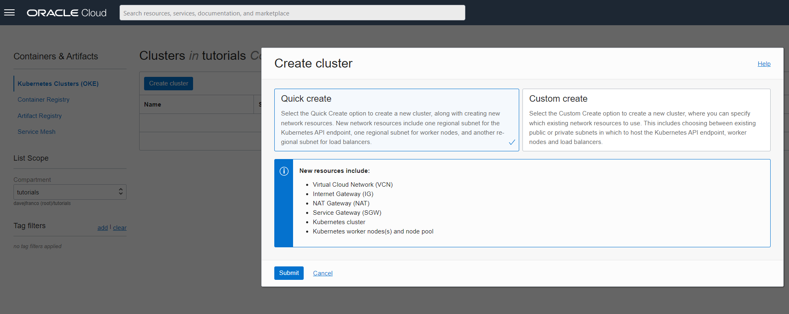
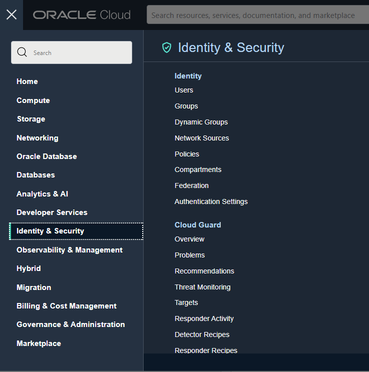
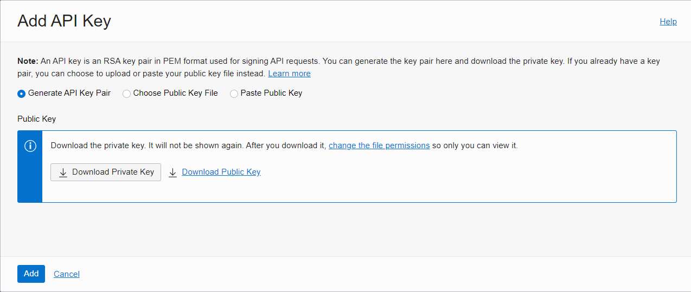
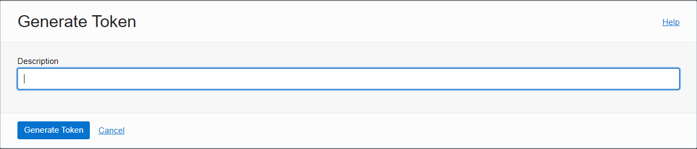
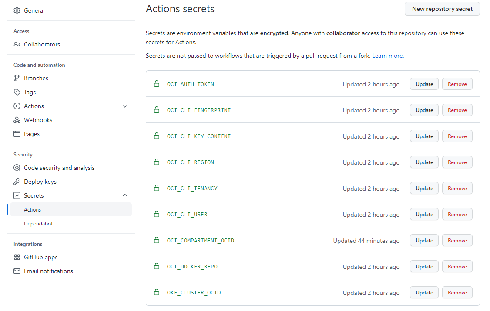

## DEMO: Deploy to Oracle OKE from Github Actions

This repo has the intention to showcase how to configure github actions to deploy an application in Oracle Kubernetes Engine (OKE)

### Requirements
- Oracle Cloud Infrastructure account, you can get one [here](https://www.oracle.com/cloud/free/)

### Steps

1. Create OKE cluster - go to Menu -> Developer Services -> Kubernetes Clusters (OKE) -> Quick Create


2. Once ready get kubeconfig
    ```
    oci ce cluster create-kubeconfig --cluster-id <cluster ocid> --file $HOME/.kube/config --region us-ashburn-1 --token-version 2.0.0  --kube-endpoint PUBLIC_ENDPOINT
    ```
3. Create a deployment user and group. Go to Menu -> Identity & Security -> User and the group


4. Create a policy to grant access to Oracle container registry and OKE. Go to Menu -> Identity & Security -> policies
    ```
    Allow group Deployment to manage repos in tenancy
    Allow group Deployment to manage cluster-family  in compartment tutorials
    ```
5. Generate User API Key. Go to Menu -> Identity & Security -> User -> User Details -> Add API Key


6. Generate User Token. Go to Menu -> Identity & Security -> User -> User Details -> Auth Tokens -> Generate Token


7. Clone this repo and add the following secrets in the setting section.


8. Create demo namespace
    ```
    kubectl create namespace demo
    ```
9. Crate docker registry secret
    ```
    kubectl create secret docker-registry ocirsecret --docker-server=iad.ocir.io --docker-username='<Tenancy name>/<username>' --docker-password='<user auth token>' -n demo
    ```

Once ready you can push to main branch and your good to go!